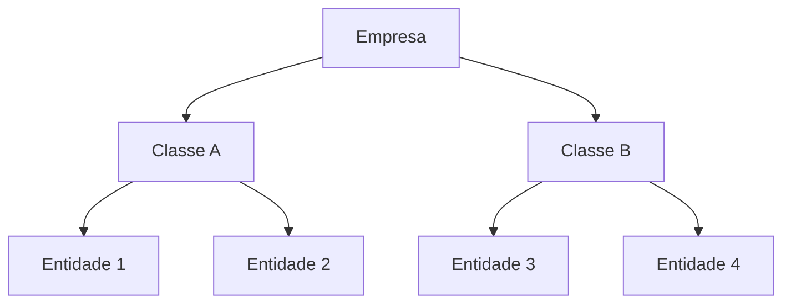

O SAN Talk AI organiza sua operação em uma hierarquia de três níveis: **Empresa**, **Classe** e **Entidade**. Cada nível tem suas próprias configurações, usuários e permissões.

## Hierarquia

### Empresa
O nível mais alto. Representa sua organização ou grupo empresarial.
- Configurações globais (personalidade, compliance)
- Gestão de assinaturas
- Visão consolidada de métricas

### Classe
Agrupamento intermediário para segmentar entidades.
- Exemplo: "Região Sul", "Premium", "Varejo"
- Métricas agregadas do grupo

### Entidade
A unidade operacional — cada loja, filial ou departamento.
- Canal de WhatsApp próprio
- Atendentes próprios
- Campanhas e contatos próprios
- Configurações específicas de atendimento

## Gerenciamento

No Dashboard, acesse **Administração > Empresas e entidades**:

- **Criar entidades** — adicione novas unidades operacionais
- **Editar informações** — atualize dados da entidade
- **Gerenciar usuários** — adicione ou remova atendentes de cada entidade
- **Excluir** — remova entidades que não são mais necessárias

<Note>
  Cada entidade é isolada — os contatos, conversas e configurações de uma entidade não são visíveis por outra. Gestores no nível de empresa ou classe têm visão agregada.
</Note>
