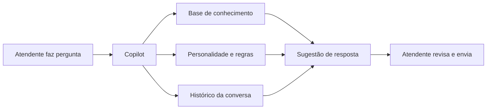

O Copilot é um assistente de IA integrado à tela de atendimento que ajuda seus atendentes humanos a responder clientes de forma mais rápida e precisa.

## Como funciona

Durante uma conversa, o atendente pode consultar o Copilot a qualquer momento. O assistente:

1. Analisa o contexto da conversa atual
2. Consulta a [base de conhecimento](/base-de-conhecimento/visao-geral) da empresa
3. Considera as regras de [personalidade](/ia-e-personalidade/personalidade), [compliance](/ia-e-personalidade/compliance) e [diretrizes](/ia-e-personalidade/diretrizes)
4. Sugere uma resposta personalizada para o atendente

## Quando usar

O Copilot é especialmente útil quando:

- O atendente precisa de informações técnicas ou de políticas da empresa
- A pergunta do cliente é complexa e exige consulta à base de conhecimento
- O atendente é novo e precisa de suporte para manter o tom de voz da marca

<Tip>
  O Copilot mantém o histórico da conversa em cache, então sugestões ficam cada vez mais contextuais ao longo da interação.
</Tip>

## Diferença entre Copilot e Agente de IA

| Aspecto | Agente de IA | Copilot |
|---------|-------------|---------|
| **Quem responde** | A IA responde diretamente ao cliente | O atendente humano responde |
| **Controle** | Automático | O atendente decide se usa a sugestão |
| **Uso** | Atendimento autônomo | Suporte ao atendente |
| **Audience** | `ai_agent` | `copilot` |
