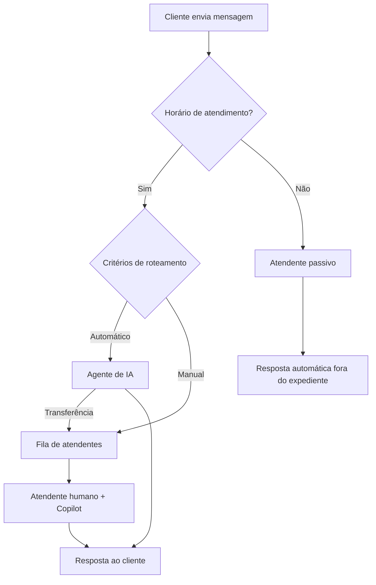

O SAN Talk AI oferece um sistema completo de atendimento ao cliente que combina inteligência artificial com atendentes humanos. As conversas chegam via WhatsApp e são roteadas automaticamente conforme as regras configuradas.

## Como funciona o fluxo

## Componentes do atendimento

<CardGroup cols={2}>
  <Card title="Conversas" icon="message" href="/atendimento/conversas">
    Gerencie conversas em tempo real, atribua a atendentes e acompanhe o histórico.
  </Card>
  <Card title="Copilot" icon="user-astronaut" href="/atendimento/copilot">
    Assistente de IA que ajuda atendentes humanos com sugestões em tempo real.
  </Card>
  <Card title="Atendente passivo" icon="moon" href="/atendimento/atendente-passivo">
    IA que atende automaticamente fora do horário de expediente.
  </Card>
  <Card title="Widget de chat" icon="comment-dots" href="/atendimento/widget-de-chat">
    Widget embutível para sites que conecta ao SAN Talk AI.
  </Card>
</CardGroup>

## Funcionalidades principais

### Gerenciamento de conversas
- Criar, listar e acompanhar conversas em tempo real
- Atribuir conversas a atendentes específicos
- Finalizar conversas com motivo de encerramento
- Visualizar histórico completo de mensagens

### Multicanal
- WhatsApp Web (via Evolution API)
- WhatsApp Business Account (WABA - API oficial da Meta)
- Widget de chat para sites

### Roteamento inteligente
- Regras de roteamento configuráveis por prioridade
- Distribuição automática entre atendentes
- Transferência de IA para humano quando necessário

### Mensagens
- Texto, imagens, áudio e documentos
- Reações a mensagens
- Edição e exclusão de mensagens
- Indicadores de presença (digitando, gravando áudio)
