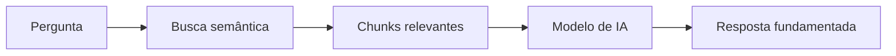

## O que é RAG?

RAG (Retrieval-Augmented Generation) é uma técnica que combina **busca semântica** com **geração de texto por IA**. Em vez de o modelo inventar respostas, ele consulta sua base de conhecimento real e gera respostas fundamentadas.

## Como funciona no SAN Talk AI

### 1. Base de conhecimento
Seus documentos, FAQs e conteúdo de sites são processados e armazenados em um **banco de dados vetorial** (embeddings). Cada pedaço de conteúdo vira um "chunk" com metadados.

### 2. Busca semântica
Quando você envia uma consulta, o sistema converte o texto em um vetor e busca os chunks mais similares — mesmo que usem palavras diferentes.

> "Como devolver um produto?" encontra conteúdo sobre "política de devolução" mesmo sem usar as mesmas palavras.

### 3. Geração de resposta (opcional)
Se você usar `returnMode: "ai_generated_answer"`, um modelo de IA gera uma resposta natural usando os chunks encontrados como base.

## Conceitos-chave

### Source Types

| Tipo | Descrição |
|------|-----------|
| `document` | Documentos carregados (PDF, DOCX, etc.) |
| `qa` | Pares de pergunta e resposta cadastrados |
| `website` | Conteúdo extraído de sites via crawling |

### Audience

| Audience | Uso |
|----------|-----|
| `ai_agent` | Agentes de IA que atendem clientes diretamente |
| `copilot` | Assistentes que ajudam atendentes humanos |
| `strategist` | Análise estratégica e insights |

### Score Threshold

O `scoreThreshold` (0 a 1) define o nível mínimo de relevância:

- **0.5 - 0.6**: Mais resultados, menor precisão
- **0.7 - 0.8**: Equilíbrio entre quantidade e qualidade (recomendado)
- **0.9+**: Apenas resultados altamente relevantes

### Reranking

Quando `useRerank: true`, os resultados passam por um segundo modelo que reordena por relevância real.

## Modos de retorno

### `chunks_only`
Retorna apenas os chunks brutos. Útil quando você quer processar os resultados no seu próprio sistema.

### `ai_generated_answer`
Retorna os chunks **e** uma resposta gerada por IA.

<Note>
  O modo `ai_generated_answer` é mais lento pois inclui a etapa de geração. Use `chunks_only` quando a latência for crítica.
</Note>
