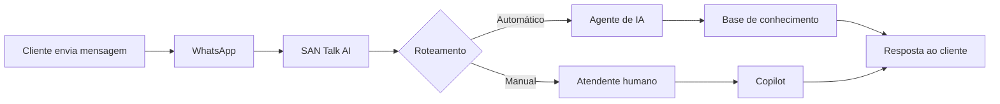

O SAN Talk AI é uma plataforma de inteligência artificial que automatiza o atendimento ao cliente, campanhas de marketing e operações de vendas via WhatsApp. Combine agentes de IA com atendentes humanos para oferecer experiências personalizadas em escala.

## O que você pode fazer

<CardGroup cols={2}>
  <Card title="Atendimento automatizado" icon="robot">
    Agentes de IA que conversam com seus clientes 24/7, usando a base de conhecimento da sua empresa para responder com precisão.
  </Card>
  <Card title="Copilot para atendentes" icon="user-astronaut">
    Assistente de IA que sugere respostas em tempo real para seus atendentes humanos durante conversas.
  </Card>
  <Card title="Campanhas via WhatsApp" icon="bullhorn">
    Envie campanhas segmentadas com templates aprovados, acompanhe métricas de engajamento e conversão.
  </Card>
  <Card title="Base de conhecimento" icon="database">
    Alimente a IA com documentos, perguntas frequentes e conteúdo de sites. O sistema usa RAG para gerar respostas fundamentadas.
  </Card>
  <Card title="Personalidade da IA" icon="brain">
    Configure tom de voz, regras de compliance e diretrizes comportamentais para que a IA represente sua marca.
  </Card>
  <Card title="Métricas e avaliações" icon="chart-line">
    Acompanhe performance de atendentes, avaliações de conversas e feedback automatizado.
  </Card>
</CardGroup>

## Como funciona

1. O cliente envia uma mensagem via WhatsApp
2. O SAN Talk AI recebe e roteia a conversa conforme as regras configuradas
3. O agente de IA consulta a base de conhecimento e responde automaticamente
4. Se necessário, a conversa é transferida para um atendente humano com suporte do Copilot

## Hierarquia organizacional

O SAN Talk AI organiza sua operação em três níveis:

| Nível | Descrição | Exemplo |
|-------|-----------|---------|
| **Empresa** | Organização principal | "Grupo Acme" |
| **Classe** | Divisão ou segmento | "Região Sul", "Premium" |
| **Entidade** | Unidade operacional (loja, filial) | "Loja Centro", "Filial SP" |

Cada entidade tem seus próprios canais, atendentes, campanhas e configurações de IA.

## Próximos passos

<CardGroup cols={3}>
  <Card title="Início rápido" icon="rocket" href="/quickstart">
    Configure e comece a usar em minutos.
  </Card>
  <Card title="Atendimento" icon="headset" href="/atendimento/visao-geral">
    Entenda como funciona o fluxo de atendimento.
  </Card>
  <Card title="API Reference" icon="code" href="/api-reference/introduction">
    Integre o SAN Talk AI ao seu sistema.
  </Card>
</CardGroup>
